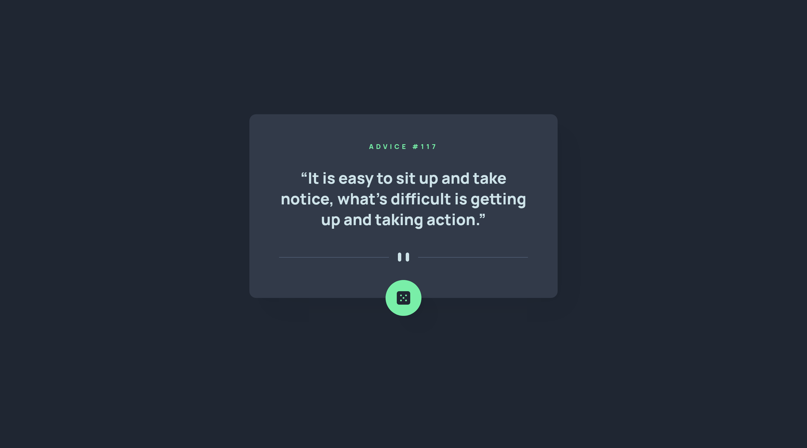
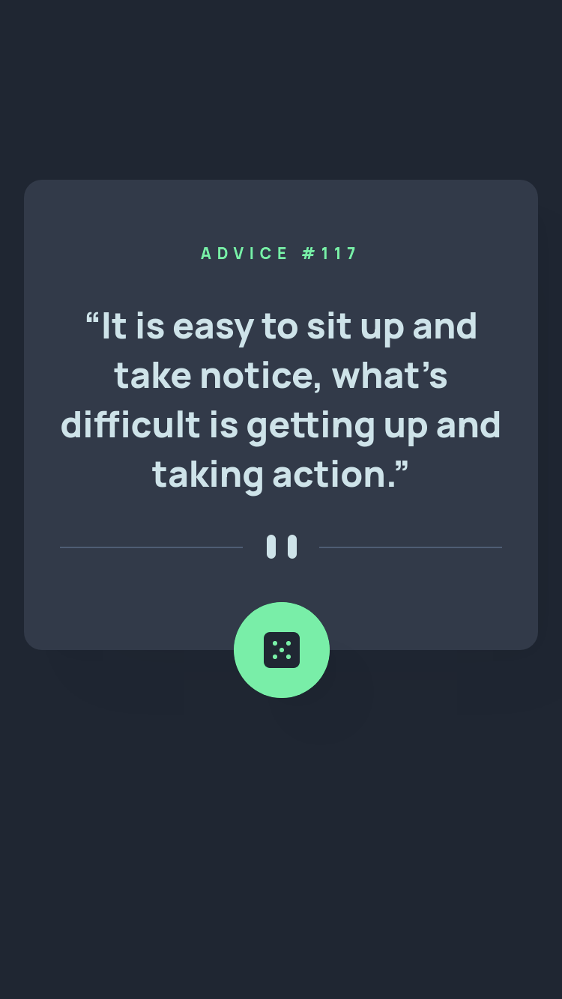

# Frontend Mentor - Advice generator app solution

This is a solution to the [Advice generator app challenge on Frontend Mentor](https://www.frontendmentor.io/challenges/advice-generator-app-QdUG-13db). Frontend Mentor challenges help you improve your coding skills by building realistic projects.

## Table of contents

- [Overview](#overview)
  - [The challenge](#the-challenge)
  - [Screenshots](#screenshots)
  - [Links](#links)
- [My process](#my-process)
  - [Built with](#built-with)
  - [What I learned](#what-i-learned)
  - [Continued development](#continued-development)
  - [Useful resources](#useful-resources)
- [Author](#author)

## Overview

### The challenge

Users should be able to:

- View the optimal layout for the app depending on their device's screen size
- See hover states for all interactive elements on the page
- Generate a new piece of advice by clicking the dice icon

### Screenshots

### Links

- Solution URL: [https://www.frontendmentor.io/solutions/advice-generator-app-using-fetch-and-semantic-htmlcss-ilbCElCEzo](https://www.frontendmentor.io/solutions/advice-generator-app-using-fetch-and-semantic-htmlcss-ilbCElCEzo)
- Live Site URL: [https://joshjavier.github.io/advice-generator-app/](https://joshjavier.github.io/advice-generator-app/)

## My process

### Built with

- Semantic HTML5 markup
- Flexbox
- Mobile-first workflow
- Fetch API
- Async/Await

### What I learned

I learned about how to make icon buttons accessible.

### Continued development

While testing, I encountered some data from the API that contained codes/entities instead of the actual characters (for example, [Advice #146](https://api.adviceslip.com/advice/146)). Thus, I need to decode the data first before they can be displayed on the page. I think this can be solved by using a package like [entities](https://github.com/fb55/entities) but that means I have to deploy my site in Netlify... another day perhaps.

### Useful resources

- [Accessible Icon Buttons](https://www.sarasoueidan.com/blog/accessible-icon-buttons/) - Really helpful resource on the different approaches for making icon buttons accessible.
- [Smooth Shadow](https://shadows.brumm.af/) - I used this tool to come up with some smooth shadows for the card and button elements.
- [Designing Beautiful Shadows in CSS](https://www.joshwcomeau.com/css/designing-shadows/) - Good read by another Josh on designing beautiful shadows in CSS. This is where I found the tool for generating smooth shadows.
- [How and when to use Async and Defer attributes](https://zellwk.com/blog/javascript-async-and-defer/) - Good refresher on whether to use `defer` or `async` in script tags.

## Author

- Website - [Josh Javier](https://joshjavier.com/)
- Frontend Mentor - [@joshjavier](https://www.frontendmentor.io/profile/joshjavier)
- Twitter - [@joshjavierr](https://twitter.com/joshjavierr)
- Codepen - [@joshjavier](https://codepen.io/joshjavier/)
- Codewars - [@joshjavier](https://www.codewars.com/users/joshjavier)
